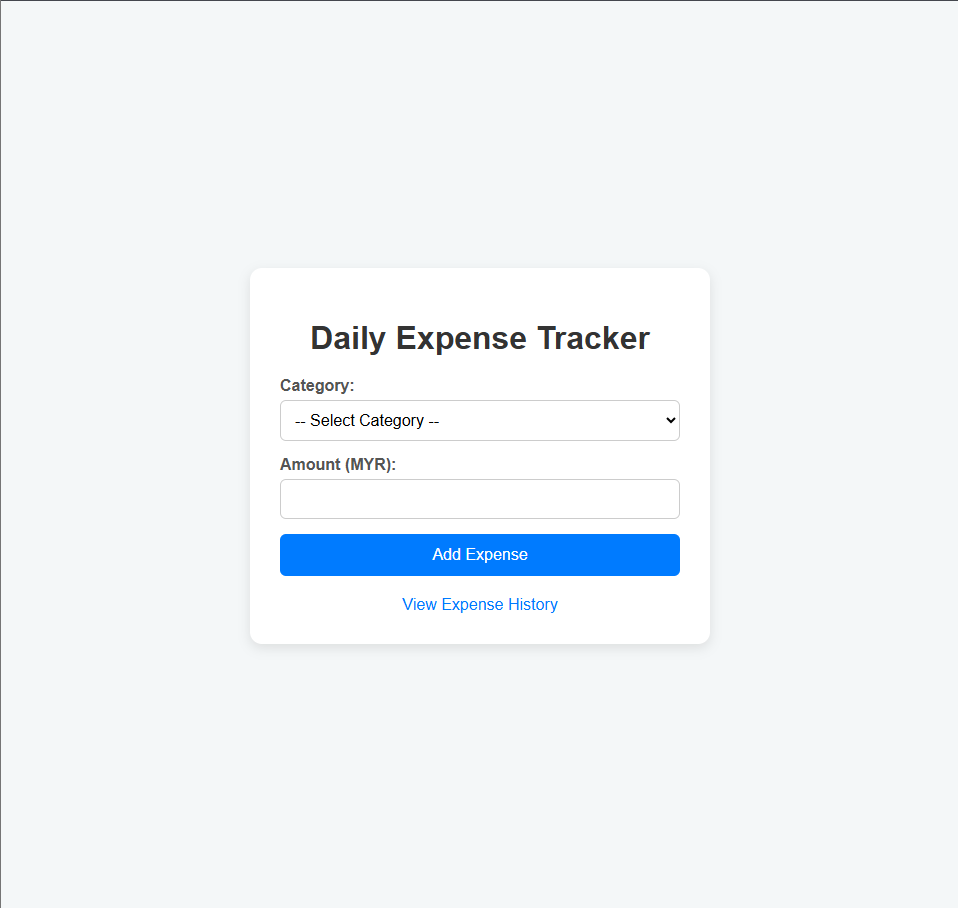
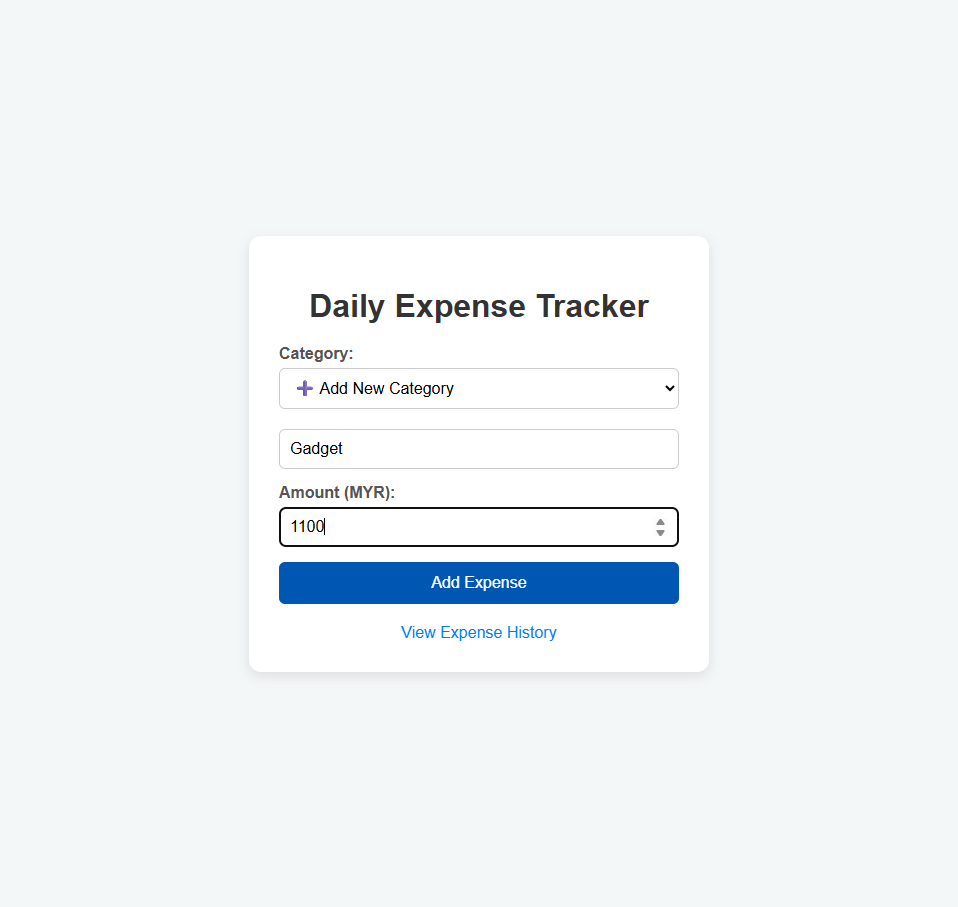
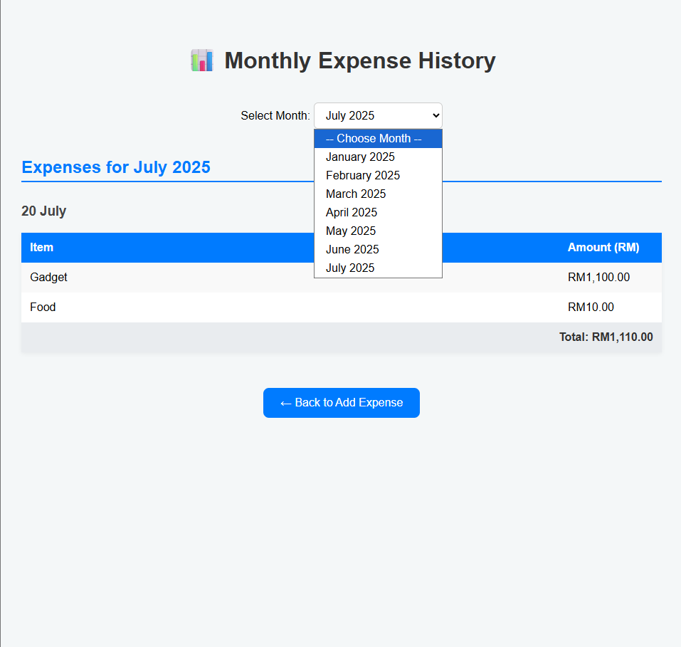

# 💰 Daily Expense Tracker

A simple, beginner-friendly **PHP + HTML** web app that allows users to **add and view their daily expenses** with organized history by date and month.

---

## 📌 Features

- Add daily expenses with amount and category
- Support for custom categories
- View expense history:
  - Grouped by day and month
  - Total amount spent per day
- Monthly dropdown selector
- Clean and simple UI

---

## 🧩 Tech Stack

- **Frontend:** HTML, CSS
- **Backend:** PHP
- **Storage:** Plain text file (`expenses.txt`)

---

## 🖥️ How to Run

1. **Install [XAMPP](https://www.apachefriends.org/) or any local PHP server.**
2. Place the project inside the `htdocs` folder. For example: C:\xampp\htdocs\Portfolio\Expense tracker\
3. Start **Apache** from XAMPP.
4. Open your browser and go to: http://localhost/Portfolio/ExpenseTracker/main.html  
 
---

## 📂 Folder Structure

Expense tracker/  
├── main.html # Add new expense  
├── history.php # View past expenses  
├── list.php # Save to expenses.txt  
├── expenses.txt # Stored data  
  
---

## 🖼️ Screenshots

**1) The main screen**   
   
 

**2) User can add item based on category**  
   
 

**3) User can view history based on month**    
   
 

**4) After item is added, user can add more items or view history**    
   
 

---

## ✅ Future Improvements

- Use a database instead of `.txt` file
- Filter by week/year
- Export to CSV
- Add authentication (user accounts)

---

## 🧑‍💻 Author

Mikail — Diploma in Software Engineering, German Malaysian Institute

---
