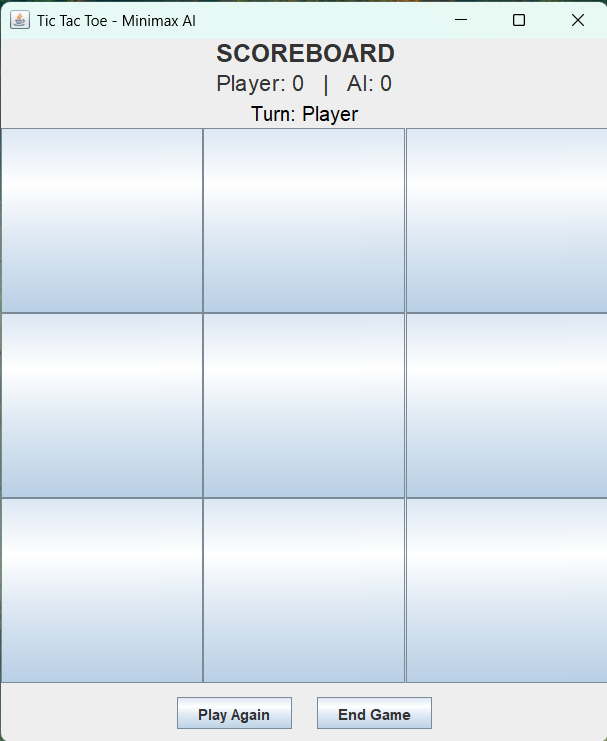

# ❌⭕ Tic Tac Toe – Minimax AI

A beginner-friendly **Java Swing GUI** project that lets users play **Tic Tac Toe** against an **AI powered by the Minimax algorithm**. It features a clean interface, score tracking, and smart AI decisions.

---

## 📌 Features

- Classic 3x3 Tic Tac Toe board  
- Play against computer AI (Minimax logic)  
- Real-time win/tie detection  
- Score counter for both player and AI  
- Game reset after each round  
- Simple and intuitive UI using Java Swing  

---

## 🧩 Tech Stack

- **Language:** Java  
- **GUI:** Java Swing  
- **AI Logic:** Minimax algorithm (unbeatable)  

---

## 🖥️ How to Run

1. Open the project in **NetBeans** or any Java IDE  
2. Make sure Java SDK is installed  
3. Run the main class:  
   `TicTacToeMinimax.java`  
4. Start playing against the AI in the GUI window  

---

## 🎮 Screenshot

  
Simple 3x3 grid layout with current turn and score display.

  
The Minimax Algorithm will find the best possible move to win.

---

## ✅ Future Improvements

- Add 2-player (local) mode  
- Add difficulty levels for AI  
- Add sound effects and animations  
- Mobile or web version using another framework  

---

## 🧑‍💻 Author

**Mikail** — Diploma in Software Engineering, German Malaysian Institute  

---
